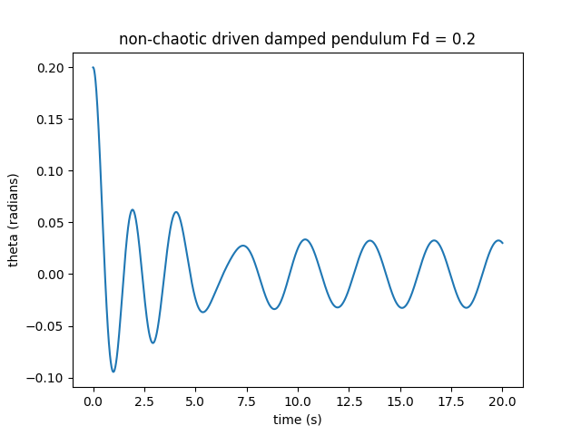
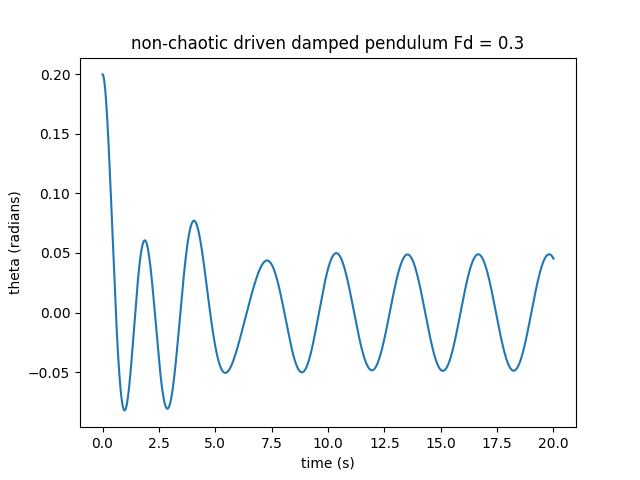
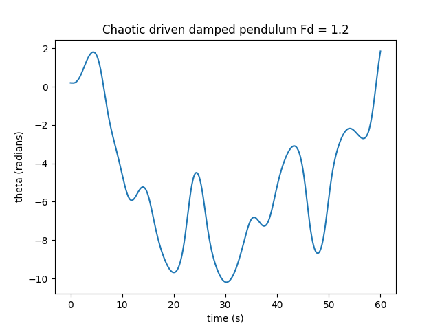
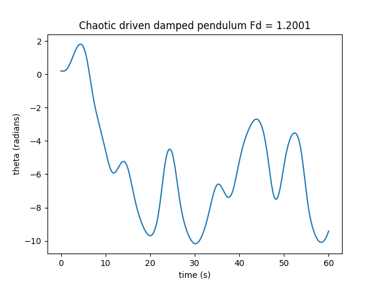
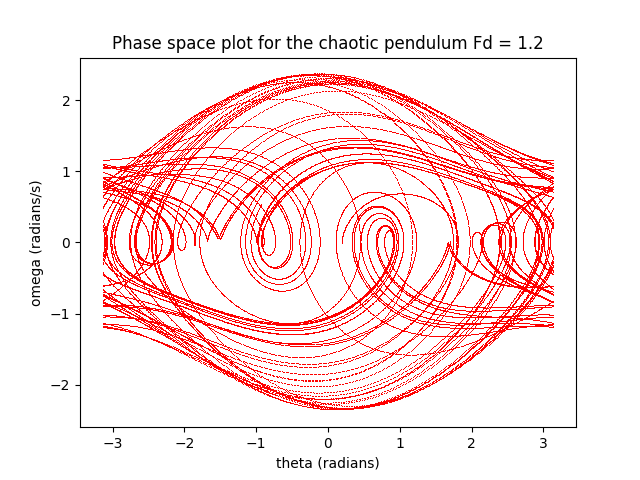

# Chaotic Pendulum
### author: John Francis 1/26/2024

# Introduction
This project explores figures and problems about chaos from "computational physics, second edition" by Giordano and Nakanishi.

# Overview
Chaos is an interesting phenomena in physics. In physics, we like to be able to predict something's behavior at a later time. Many systems have a predictable outcome, that doesn't vary much with initial conditions. For example. If someone were to throw a ball at 10 m/s from x = 1 m versus x = 1.0001 m, it would probably land in a very similar spot. Even in harder problems that can't be solved analytically, we can usually predict where they will be using a numerical method. For example, throwing a ball with air drag, magnus force, and coriolis force. 

Certain systems don't behave in such a predictable way. These are called chaotic systems. In a chaotic system, one extremely small change in an initial condition could cause a drastically different outcome down the line. 

# The driven-damped pendulum

Here we will explore a very simple chaotic system, the driven-damped pendulum. A driven-damped pendulum is an ideal pendulum, which periodically swings from the driving of gravity, and adds a linear damping force (friction or simplified air drag) as well as a periodic driving force. This periodic driving force is sinusodal, meaning that it has a period (omega) when it drives strongest. The driving force can be compared to somebody bumping the pendulum every one second periodically. The equation of motion for this pendulum is the following second-order differential equation:

$$ \frac{d^2\theta}{dt^2} = -\frac{g}{l}\sin \theta - q \frac{d\theta}{dt} + F_D \sin (\Omega_Dt)$$

Which can be translated into 2 coupled first-order differential equations to make it easier to code:

$$\frac{d\omega}{dt} = -\frac{g}{l}\sin \theta - q \frac{d\theta}{dt} + F_D \sin (\Omega_Dt)$$

$$\frac{d\theta}{dt} = \omega$$

Now, if the driving force is small, there isn't much chaos. The system simply settles into a periodic rhythm. If we change the initial conditions, we don't see much difference. Here, we have plotted the theta vs. time graphs for a pendulum with driving force 0.2 vs. 0.3.




When we start increasing the driving force, we start to see some chaos. Here is the same pendulum but this time with a driving force of 1.2. We will also compare with a graph of driving force=1.2001 just to show how much the initial conditions affect the future behavior. 




# Patterns in chaos

With a little more investigation, we can find some patterns to the chaos. Consider the phase-space plot of the same driven-damped pendulum. This plot shows theta vs. omega, and we start seeing some interesting patterns showing up.




# Coding this problem

This code features a second order runge-kutta method to find the position of the pendulum at the next theta. There is a class, "Pendulum" that handles most of the logic. 

# Development environment

This simulation is coded in Python, using numpy and matplotlib libraries.

How to install using python virtual environment (windows):

```
python -m venv venv
venv/Scripts/activate
pip install -r requirements.txt
```
